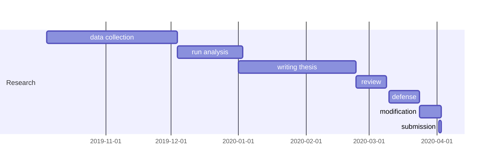

## Research Progress

My first post. Other [syntax examples](https://sourcethemes.com/academic/docs/writing-markdown-latex/) could be found on the website.


### Timeline

I used [mermaid](https://mermaidjs.github.io/#/) to plot the diagram of my dissertation timeline.




A> Final submission to Graduate School is due on 2020-04-02.


Belows are other examples you could do on the blog.


### Todo lists

You can even write your todo lists in Academic too:

```markdown
- [x] Write the discussion  (due 10-15-2019)
- [ ] Practice 3MT
- [ ] Send out remindert to participants
```

renders as

- [x] Write the discussion  (due 10-15-2019)
- [ ] Practice 3MT
- [ ] Send out remindert to participants

### Tables

Represent your data in tables:

```markdown
| First Header  | Second Header |
| ------------- | ------------- |
| Content Cell  | Content Cell  |
| Content Cell  | Content Cell  |
```

renders as

| First Header  | Second Header |
| ------------- | ------------- |
| Content Cell  | Content Cell  |
| Content Cell  | Content Cell  |

### Asides


```markdown
A> A Markdown aside is useful for displaying notices, hints, or definitions to your readers.
```

renders as

A> A Markdown aside is useful for displaying notices, hints, or definitions to your readers.
